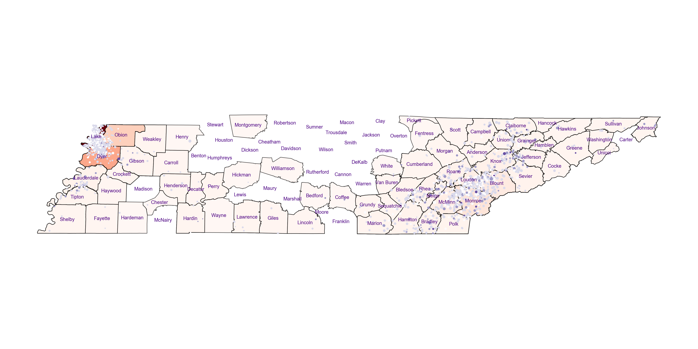

### #Web scraping data to find the trends of the earthquakes in Tennessess

#### Context:
Nate Silver discusses the difficulty of predicting earthquakes in The Signal and the Noise. Nevertheless, we will try to identify some patterns by analyzing the deadly earthquakes that have occurred since 1900.
#### Data Source:
* Earthquake data: https://en.wikipedia.org/wiki/List_of_deadly_earthquakes_since_1900
- The USGS's API (https://earthquake.usgs.gov/fdsnws/event/1/) 
#### Data questions:
- Are there factors that make an earthquake more likely?
- Are there factors that make an earthquake more deadly?
- Where would you live if you wanted to eliminate the risk of experiencing a deadly earthquake? Where would you avoid living?
- How many earthquakes are in the dataset? Which region of Tennessee seems to be the most prone to earthquakes? Which is the least prone?
- Do the magnitudes of earthquakes seem to follow the distribution described by Nate Silver. That is, one higher magnitude is ten times less likely to occur?
- How worried do Tennesseans need to be about a deadly earthquake striking? What about Nashvillians?
#### Data clean tasks:
- Remove the footnotes from the 'Other Source Deaths' column
- Convert Magnitude to numeric
- Correct number of deaths when there is more than one value. When there is more than one value given, choose the largest.
- Create a new column ('deaths') that evaluates the four total-death columns ('PDE Total Deaths', 'Utsu Total Deaths', 'EM-DAT Total Deaths', and 'Other Source Deaths') and populates the new column with the highest value.
- Explore the data in terms of when and where earthquakes occurred and how severe they were (magnitude, deaths, secondary effects).

